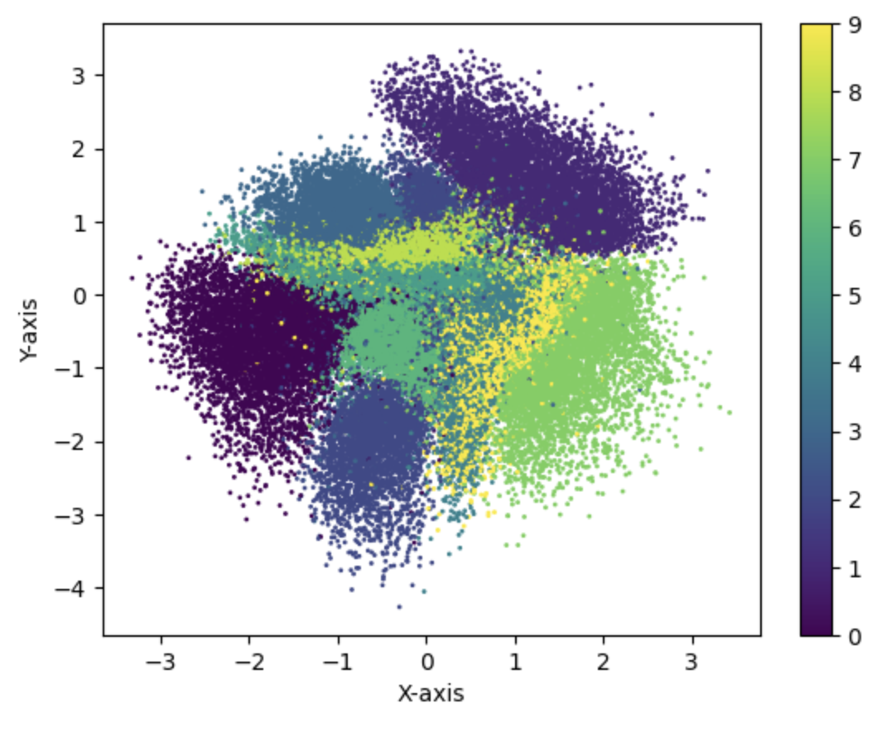

# VAE on MNIST Dataset

In this code, I have applied VAE on MNIST dataset. The idea is to create a 2D latent space where different coordinates can be mapped to different numbers. The basic structure of the code has been taken from https://github.com/rasbt 

Below is a representation of different number in the latent space:

